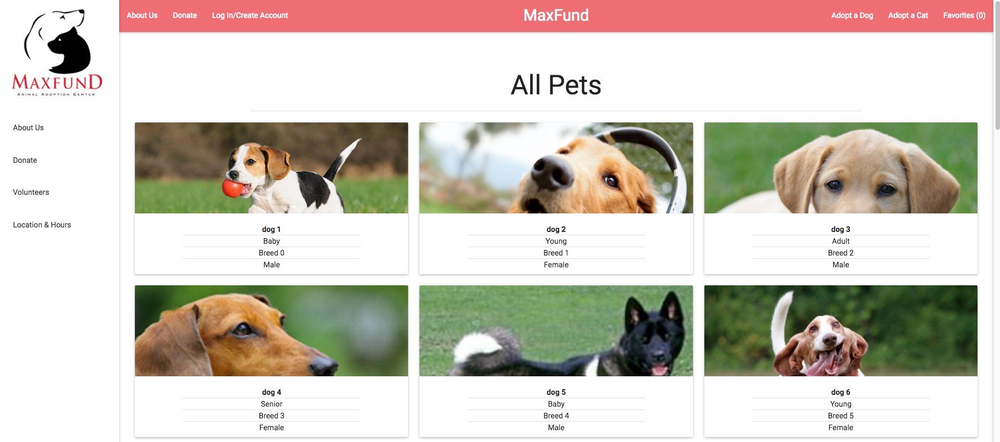

# Max-Fund Animal Shelter
##### Pair Project by [Ali Andersen](https://github.com/alirezaandersen), [Jon Liss](https://github.com/jdliss), [Drew Thompson](https://github.com/drew-t)

## A redevelopment of a website for Denver-based animal shelter, which added additional features to meet the clients’ needs.(work continuously in progress), Some features allow online reservation to meet an animal your interested in adopting, having a favorites list, and updates of new animals added. Stack: Rails, PostgresSQL, multi-level admin functionality, Heroku, RSpec, Materialize.

[Find your Best Friend!](http://max-fund.herokuapp.com//)

#### To get things started:

* Clone file
* bundle install
* rake db:create, db:migrate, db:seed
* Once all dependencies are installed run rails s
#### To run test:
 run rspec
